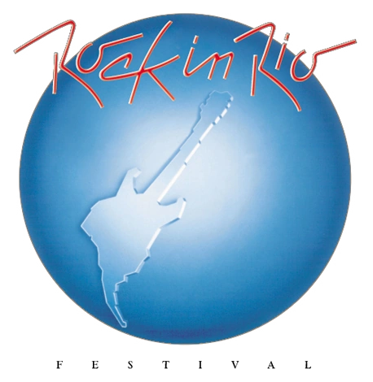

<html lang="pt-BR">
<head>
  <meta charset="UTF-8">
  <meta name="viewport" content="width=device-width, initial-scale=1.0">
  <title>Exemplo de fontes</title>

  <!-- Preconexão e carregamento das fontes -->
  <link rel="preconnect" href="https://fonts.googleapis.com">
  <link rel="preconnect" href="https://fonts.gstatic.com" crossorigin>
  <link href="https://fonts.googleapis.com/css2?family=Roboto+Flex:wght@100&family=Sixtyfour+Convergence&display=swap" rel="stylesheet">
</head>
<body>
  <!-- Div com fonte personalizada -->
  <div style="text-align: center; font-family: 'Sixtyfour Convergence', sans-serif; font-weight: 100;">
    <h6>
      <a href="#️vídeozinho-do-projeto-rodando" style="text-decoration: underline;">
        <strong>video do projeto</strong>
      </a>
    </h6>
</div>


<h1 align="center">

<p>Rock in Rio 2024 🎸</p>
</h1>

<h2 align="center"><p>📌 Objetivo do programa</p</h2>

#### *Armazenar diversas informações de serviços disponíveis no show*
###### *O Foco do programa é para os funcionários do evento*
###### ***Um Projeto de implementação de várias estruturas de dados***

<h2 align="center">⚙️Quais as funções desse programa?</h2>

<h2 align="center">🛠️Quais as ferramentas usadas nesse projeto?</h2>

- [Python](https://docs.python.org/3/)🐍
- [Tk](https://docs.python.org/pt-br/3/library/tkinter.html) 🪟

<h2 align="center">📂O que tem em cada pasta?</h2> 

<h2 align="center">🧐Como executar?</h2>


````bash
# Dê dois cliques em Rock in Rio.ink
````
````bash
# Ou com python instalado rode com terminal nesta pasta
$ py main.py 
````
<center>

## 📽️Vídeozinho do projeto rodando

</center>